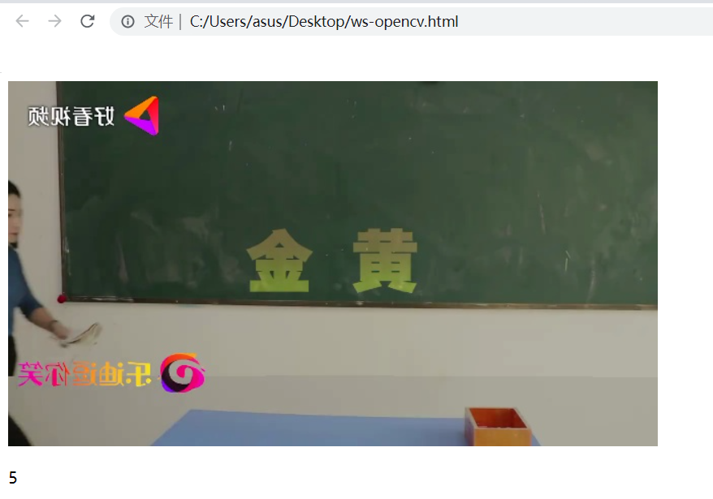

## 基于opencv的web可视化Demo

> 安装博客：https://mp.csdn.net/mp_blog/creation/success/132788898

# 一、使用到的相关链接

- 参考
  - https://gitee.com/AlEX_2473/opencv-websocket?_from=gitee_search
  - https://github.com/zaphoyd/websocketpp
- 安装教程
  - [Websocket++安装使用 - 知乎 (zhihu.com)](https://zhuanlan.zhihu.com/p/59925926)

## 二、编译教程（Ubuntu为例）

> 遇到相关问题可以参考：[Websocket++安装使用 - 知乎 (zhihu.com)](https://zhuanlan.zhihu.com/p/59925926)

## 1、安装环境

- **安装boost**

  ```
  sudo apt-get install libboost-all-dev
  ```

- **安装WebSocket++**

  ```
  git clone https://github.com/zaphoyd/websocketpp （将websocketcpp下载到本地）
  cd websocketcpp （进入websocketcpp目录）
  mkdir build （创建build目录，存放cmake生成的中间文件）
  cd build （进入build目录）
  cmake .. （执行CMakeList.txt）
  make
  make install
  ```

## 2、测试安装

```
cd websocketpp/examples/echo_server
g++ -o echo_server echo_server.cpp -lboost_system -lpthread（编译链接echo_server）
./echo_server（启动服务器端）
cd websocketpp/examples/echo_client（编译链接echo_client）
g++ -o echo_client echo_client.cpp -lboost_system -lpthread（启动客户端）
./echo_client
```

# 三、编译运行视频传输服务端

> 想要修改相关的服务端端口和播放视频，可以 vim Websocket/src/main.cpp

```
# 端口默认9000，修改的话，如下
wsserver.listen(9000);

# 播放地址可以在这里修改
cap.open("https://vd3.bdstatic.com/mda-kidf9t0h94ga32tu/v1-cae/sc/mda-kidf9t0h94ga32tu.mp4?v_from_s=hkapp-haokan-hnb&auth_key=1692682929-0-0-fb7bc38357c4376537d42d3f399d63ad&bcevod_channel=searchbox_feed&pd=1&cr=2&cd=0&pt=3&logid=2529742350&vid=9815726611466644147&klogid=2529742350&abtest=111803_4-112162_4");
```


## 1、编译

```
# 建立build目录
mkdir Websocket/build
# 进入build目录
cd build
# 编译
cmake ..
make 
```

## 2、运行

```
./WebSocketServer
```

# 四、Web客户端的修改

## 1、修改web的ip和端口

```
# 修改ws-opencv.html的ip和端口
let  ws = new WebSocket('ws://172.16.25.199:9000');
```

## 2、直接点击ws-opencv.html,显示如下

